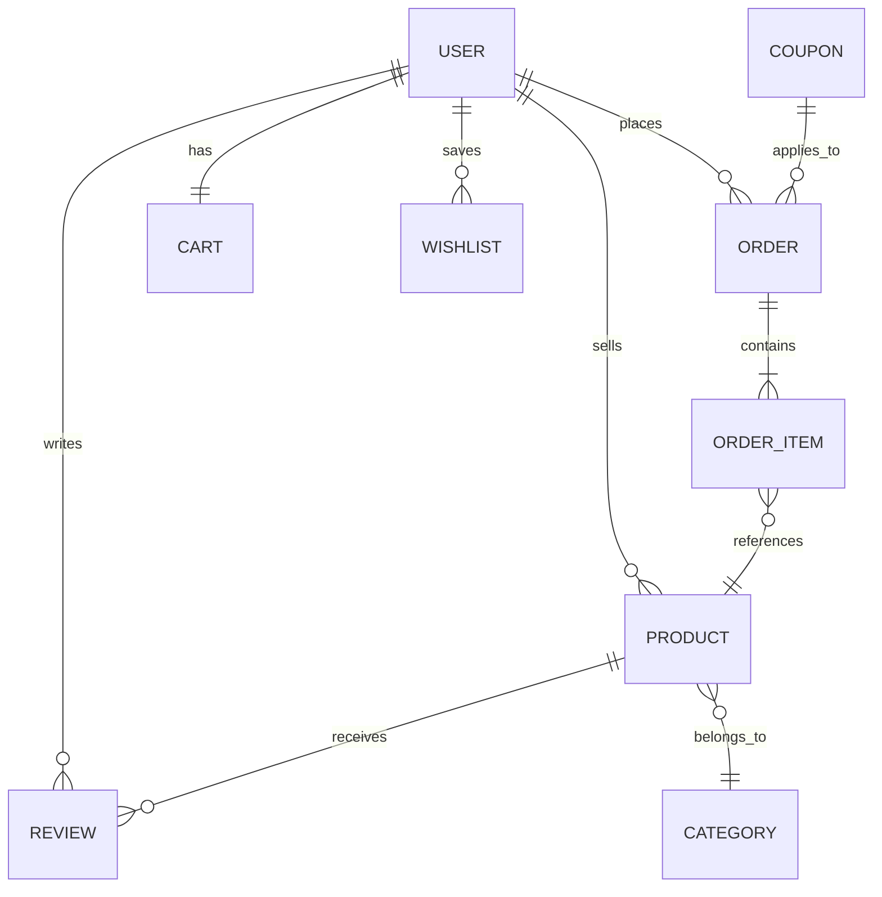

<div align="center">

# 🛒 ALEEM MART

### Premium Multi-Vendor Ecommerce Marketplace


<br/><br/>

> A full-stack, production-grade **Amazon-level** multi-vendor marketplace with Buyer, Seller, and Admin portals — built with modern web technologies.

[Live Demo](#) · [Report Bug](https://github.com/aleemrana8/Aleem-Mart-/issues) · [Request Feature](https://github.com/aleemrana8/Aleem-Mart-/issues)

</div>

---

## 📋 Table of Contents

- [About](#-about)
- [Tech Stack](#-tech-stack)
- [Features](#-features)
- [Architecture](#-architecture)
- [Pages & Routes](#-pages--routes)
- [API Endpoints](#-api-endpoints)
- [Getting Started](#-getting-started)
- [Database Models](#-database-models)
- [Security](#-security)
- [Deployment](#-deployment)
- [Roadmap](#-roadmap)
- [License](#-license)

---

## 🎯 About

**Aleem Mart** is a scalable, real-time multi-vendor ecommerce platform that enables:

| Role | Capabilities |
|------|-------------|
| 🛍️ **Buyer** | Browse, search, cart, checkout, order tracking, wishlist, reviews, rewards |
| 🏪 **Seller** | Product management, order fulfillment, analytics, discounts, store customization |
| 👑 **Admin** | Platform oversight, user management, banners, coupons, system settings |

### Scope

- **Multi-Vendor Marketplace** — Multiple sellers, one unified storefront
- **Real-Time Communication** — Socket.io powered messaging & notifications
- **AI-Powered Features** — Smart recommendations, trending products, autocomplete search
- **Payment Integration** — Stripe, JazzCash, Easypaisa, COD
- **Analytics Dashboard** — Revenue charts, conversion funnels, customer insights
- **Loyalty System** — Points, rewards, and gamification

---

## 🚀 Tech Stack

<div align="center">

### Frontend
| Technology | Purpose |
|:----------:|:--------|
|  | App Router, SSR, API Routes |
|  | UI Component Library |
|  | Type Safety |
|  | Utility-First Styling |
|  | State Management |
|  | Animations |
|  | Data Visualization |
|  | Accessible Components |

### Backend
| Technology | Purpose |
|:----------:|:--------|
|  | REST API Server |
|  | Database & ODM |
|  | Authentication |
|  | Real-Time Events |
|  | Payment Processing |
|  | Media Storage |
|  | Email Service |
|  | Containerization |

</div>

---

## ✨ Features

### 🛍️ Buyer Portal
| Feature | Description |
|---------|-------------|
| Smart Search | AI-powered autocomplete with MongoDB text indexes |
| Product Browsing | Filters, sorting, category navigation, infinite scroll |
| Product Detail | Image gallery, specs, reviews, related items |
| Shopping Cart | Real-time quantity management, price calculation |
| Multi-Step Checkout | Address → Payment → Order Review |
| Order Tracking | Real-time status updates, order history |
| Wishlist | Save products for later |
| Reviews & Ratings | Rate products, upload photos |
| Rewards/Loyalty | Earn points, redeem for discounts |
| AI Recommendations | Personalized product suggestions |
| Real-Time Notifications | Order updates, promotions |

### 🏪 Seller Portal
| Feature | Description |
|---------|-------------|
| Dashboard | Revenue, orders, conversion metrics with charts |
| Product Management | Full CRUD, variants, images, inventory tracking |
| Order Fulfillment | Accept, process, ship, complete orders |
| Shipping Management | Configure shipping zones and rates |
| Discount Engine | Flash sales, percentage/fixed discounts, date ranges |
| Analytics | Revenue by day, product performance, customer insights |
| Review Management | View and reply to customer reviews |
| Store Customization | Logo, banner, policies, store settings |
| Real-Time Messaging | Chat directly with buyers |

### 👑 Admin Portal
| Feature | Description |
|---------|-------------|
| Platform Dashboard | KPIs, user growth, revenue overview |
| User Management | View, approve, suspend buyers & sellers |
| Product Moderation | Approve/reject seller products |
| Category Management | Create hierarchical category trees |
| Order Monitoring | Oversee all platform orders |
| Banner/CMS | Manage homepage banners and promotions |
| Coupon System | Platform-wide discount codes |
| System Settings | Platform configuration |

---

## 🏗️ Architecture

```
┌─────────────────────────────────────────────────────────────┐
│                      ALEEM MART                              │
├────────────────────────┬────────────────────────────────────┤
│     Frontend (3000)    │         Backend (5001)              │
├────────────────────────┼────────────────────────────────────┤
│  Next.js 14 App Router │  Express.js REST API               │
│  Zustand Store         │  23 Route Modules                  │
│  Tailwind CSS          │  Mongoose ODM                      │
│  Socket.io Client      │  Socket.io Server                  │
│  Framer Motion         │  JWT Auth + RBAC                   │
│  Recharts              │  Rate Limiting + Helmet            │
├────────────────────────┼────────────────────────────────────┤
│                        │              ▼                      │
│                        │  ┌────────────────────────┐        │
│                        │  │  MongoDB (Docker)      │        │
│                        │  │  Cloudinary (Media)    │        │
│                        │  │  Stripe (Payments)     │        │
│                        │  └────────────────────────┘        │
└────────────────────────┴────────────────────────────────────┘
```

### Project Structure

```
aleem-mart/
├── backend/
│   └── src/
│       ├── config/          # Database, Cloudinary, Stripe
│       ├── controllers/     # 15+ route handlers
│       ├── middleware/      # Auth, validation, error handling, security
│       ├── models/          # Mongoose schemas (User, Product, Order...)
│       ├── routes/          # 23 API route files
│       ├── services/        # Search, recommendations, analytics
│       ├── socket/          # Real-time event handlers
│       ├── utils/           # JWT, email, helpers
│       ├── app.ts           # Express app setup
│       └── server.ts        # HTTP + Socket.io server
├── frontend/
│   └── src/
│       ├── app/             # Next.js App Router (18+ pages)
│       │   ├── seller/      # Seller dashboard (10 pages)
│       │   ├── admin/       # Admin panel (9 pages)
│       │   └── ...          # Buyer pages
│       ├── components/      # UI, Layout, Home, Shared
│       ├── lib/             # API client, utilities, SEO
│       ├── store/           # Zustand (auth, cart)
│       └── types/           # TypeScript interfaces
├── docker-compose.yml
└── package.json             # Monorepo root
```

---

## 📱 Pages & Routes

### Buyer Pages
| Page | Route | Description |
|------|-------|-------------|
| Home | `/` | Hero, categories, flash sale, trending, new arrivals |
| Shop | `/shop` | All products with filters & sorting |
| Product | `/product/[slug]` | Full detail page with reviews |
| Category | `/category/[slug]` | Category-specific products |
| Search | `/search` | Search results with AI autocomplete |
| Cart | `/cart` | Shopping cart management |
| Checkout | `/checkout` | Multi-step payment flow |
| Orders | `/orders` | Order history & tracking |
| Wishlist | `/wishlist` | Saved products |
| Rewards | `/rewards` | Loyalty points & rewards |
| Login | `/login` | Authentication (Buyer/Seller) |
| Register | `/register` | Account creation |

### Seller Pages
| Page | Route | Description |
|------|-------|-------------|
| Dashboard | `/seller` | Revenue, orders, metrics charts |
| Products | `/seller/products` | Product CRUD & inventory |
| New Product | `/seller/products/new` | Add product form |
| Orders | `/seller/orders` | Order management & fulfillment |
| Shipping | `/seller/shipping` | Shipping configuration |
| Discounts | `/seller/discounts` | Discount & coupon management |
| Analytics | `/seller/analytics` | Deep analytics & insights |
| Reviews | `/seller/reviews` | Review management |
| Messages | `/seller/messages` | Buyer communication |
| Store | `/seller/store` | Store customization |
| Settings | `/seller/settings` | Account settings |

### Admin Pages
| Page | Route | Description |
|------|-------|-------------|
| Dashboard | `/admin` | Platform KPIs overview |
| Users | `/admin/users` | User management |
| Sellers | `/admin/sellers` | Seller approval & management |
| Products | `/admin/products` | Product moderation |
| Categories | `/admin/categories` | Category CRUD |
| Orders | `/admin/orders` | Order monitoring |
| Banners | `/admin/banners` | CMS banner management |
| Coupons | `/admin/coupons` | Platform coupon codes |
| Settings | `/admin/settings` | System configuration |

---

## 🔌 API Endpoints

| Base Route | Methods | Description |
|-----------|---------|-------------|
| `/api/auth` | POST | Register, Login, Logout, Refresh Token, Password Reset |
| `/api/users` | GET, PUT | Profile, Addresses, Avatar |
| `/api/products` | CRUD | Products, Search, Featured, Variants |
| `/api/categories` | CRUD | Category Tree, Nested Categories |
| `/api/cart` | GET, POST, PUT, DEL | Cart Management |
| `/api/orders` | CRUD | Order Lifecycle, Status Updates |
| `/api/reviews` | GET, POST | Reviews, Ratings, Seller Replies |
| `/api/wishlist` | GET, POST, DEL | Wishlist Items |
| `/api/coupons` | CRUD | Coupon Management, Validation |
| `/api/discounts` | CRUD | Flash Sales, Bulk Discounts |
| `/api/seller` | GET, PUT | Seller Profile, Store, Analytics |
| `/api/admin` | CRUD | Users, Sellers, Dashboard, Config |
| `/api/search` | GET | Full-Text Search, Autocomplete |
| `/api/banners` | CRUD | Homepage Banner Management |
| `/api/messages` | GET, POST | Real-Time Messaging |
| `/api/notifications` | GET, PUT | Notification Management |
| `/api/payments` | POST | Payment Intent, Webhooks |
| `/api/upload` | POST | Image/Video Upload (Cloudinary) |
| `/api/recommendations` | GET | AI Product Recommendations |
| `/api/analytics` | GET | Seller & Admin Analytics |
| `/api/ai` | GET | AI-Powered Features |
| `/api/loyalty` | GET, POST | Rewards & Points System |
| `/api/bulk` | POST | Bulk Operations |

---

## 🛠️ Getting Started

### Prerequisites

```
Node.js 18+
Docker Desktop (for MongoDB)
Git
```

### Installation

```bash
# Clone the repository
git clone https://github.com/aleemrana8/Aleem-Mart-.git
cd "Aleem Mart"

# Install all dependencies
npm install
cd backend && npm install
cd ../frontend && npm install
cd ..
```

### Start MongoDB (Docker)

```bash
docker-compose up -d
```

### Run Development Servers

```bash
# Backend (http://localhost:5001)
cd backend && npm run dev

# Frontend (http://localhost:3000)  
cd frontend && npm run dev
```

### Environment Variables

<details>
<summary>Backend <code>.env</code></summary>

```env
PORT=5001
NODE_ENV=development
MONGODB_URI=mongodb://localhost:27017/aleem-mart
CLIENT_URL=http://localhost:3000
JWT_SECRET=your-jwt-secret
JWT_REFRESH_SECRET=your-refresh-secret
JWT_EXPIRE=7d
JWT_REFRESH_EXPIRE=30d
SMTP_HOST=smtp.gmail.com
SMTP_PORT=587
SMTP_USER=your-email@gmail.com
SMTP_PASS=your-app-password
CLOUDINARY_CLOUD_NAME=your-cloud
CLOUDINARY_API_KEY=your-key
CLOUDINARY_API_SECRET=your-secret
STRIPE_SECRET_KEY=sk_test_...
```
</details>

<details>
<summary>Frontend <code>.env.local</code></summary>

```env
NEXT_PUBLIC_API_URL=http://localhost:5001/api
NEXT_PUBLIC_APP_NAME=Aleem Mart
NEXT_PUBLIC_STRIPE_PUBLISHABLE_KEY=pk_test_...
```
</details>

---

## 📊 Database Models



| Model | Key Fields |
|-------|-----------|
| **User** | firstName, lastName, email, password, role (buyer/seller/admin), isVerified |
| **Product** | name, slug, price, images, category, seller, inventory, variants, specs |
| **Category** | name, slug, parent, image, isActive |
| **Order** | orderNumber, user, items, totalAmount, status, shippingAddress, payment |
| **Review** | user, product, rating, comment, images, sellerReply |
| **Cart** | user, items (product, quantity, variant) |
| **Wishlist** | user, products |
| **Coupon** | code, type, value, minPurchase, expiry, usageLimit |
| **Discount** | product, percentage, startDate, endDate, flashSale |
| **Notification** | user, type, message, isRead |
| **Message** | conversation, sender, content, timestamp |
| **Banner** | title, image, link, position, isActive |

---

## 🔒 Security

| Measure | Implementation |
|---------|---------------|
| Password Hashing | bcrypt with 12 salt rounds |
| Authentication | JWT access + refresh token rotation |
| Authorization | Role-Based Access Control (RBAC) |
| Input Validation | Zod schema validation |
| Rate Limiting | 100 requests/15min per IP |
| CORS | Whitelist-based origin control |
| Headers | Helmet.js security headers |
| File Upload | Type & size restrictions |
| XSS Protection | Input sanitization middleware |

---

## 📈 Deployment

| Service | Recommended Platform |
|---------|---------------------|
| Frontend | Vercel / Netlify |
| Backend | Railway / Render / AWS EC2 |
| Database | MongoDB Atlas |
| Media | Cloudinary |
| Payments | Stripe |
| DNS | Cloudflare |

---

## 🗺️ Roadmap

- [x] Multi-vendor product marketplace
- [x] Buyer, Seller, Admin portals
- [x] Real-time messaging & notifications
- [x] AI-powered search & recommendations
- [x] Seller analytics dashboard
- [x] Order lifecycle management
- [x] Loyalty/rewards system
- [x] Flash sales & discount engine
- [ ] Elasticsearch integration
- [ ] Push notifications (FCM)
- [ ] Multi-language (i18n)
- [ ] React Native mobile app
- [ ] Advanced fraud detection
- [ ] CDN optimization

---

## 👨‍💻 Author

**Aleem Akhtar**  
📧 rr36132@gmail.com  
🔗 [GitHub](https://github.com/aleemrana8)

---

## 📄 License

This project is private and proprietary.  
© 2024-2026 Aleem Mart. All rights reserved.

---

<div align="center">

**⭐ Star this repo if you find it useful!**

Made with ❤️ by Aleem Akhtar

</div>
